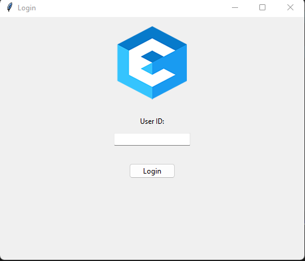
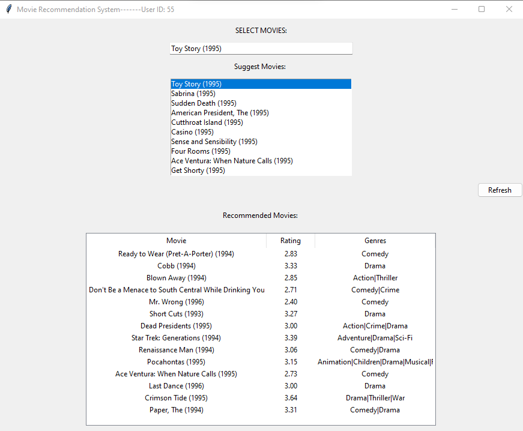
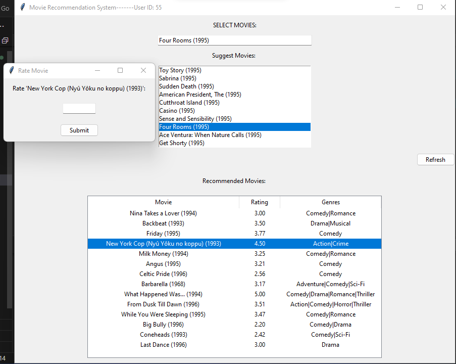

# MovieLens-Recommender-System

The MovieLens Recommender system is a movie recommendation system that uses collaborative filtering techniques to provide personalized movie recommendations to users. It is based on the MovieLens dataset, which consists of ratings and tag data provided by users on various movies. The system uses this data to find similarities between users and movies, and then uses these similarities to make recommendations.

The MovieLens Recommender system is capable of making various types of recommendations, such as personalized recommendations, popular recommendations, and new release recommendations. It can also provide explanations for its recommendations by showing similar movies that the user has liked in the past, or by highlighting certain features of a recommended movie that match the user's preferences.

Overall, the MovieLens Recommender system is a powerful tool for movie enthusiasts who want to discover new movies that they might enjoy based on their past movie watching history. It can also be used by movie streaming services to provide personalized recommendations to their users, thereby increasing user engagement and satisfaction.

  
  
  

